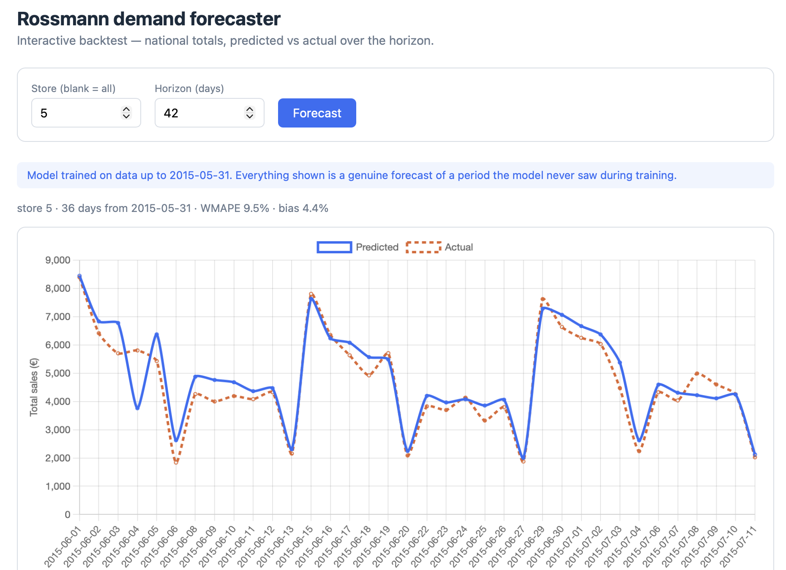

# Demand Forecasting — Supply Chain
 
End-to-end demand forecasting for 1,115 stores using the Rossmann dataset: a 42-day
forecasting horizon, predictions served through a live API with an interactive
inference demo hosted on GCP Cloud Run. The demo shows **genuine forecasts of a period
the model never saw during training** (on and after May 31st 2015), so there is no data
leakage in the demonstration.
 
**Live demo:** https://rossmann-forecaster-541488693264.europe-west1.run.app
 


> This project separates two notions of "no leakage": the **backtest** (Results
> section) evaluates without leakage via walk-forward validation, and the **demo**
> demonstrates without leakage via a holdout model frozen at a training cutoff. Two
> mechanisms, two purposes.
 
## Problem & Methodology
 
### Problem statement
 
Build a forecasting model to predict the sales amount for up to 42 days ahead. The
data covers 1,115 Rossmann stores with daily sales recorded from Jan 1st 2013 to
July 31st 2015.
 
### Exploratory Data Analysis
 
EDA (see notebook 1) shows that the distribution of sales is skewed to the right,
whereas the log distribution of sales is Gaussian. We therefore train our models on
log(sales).
 

We also found that December is a very strong month sales-wise, and that there is a
weekly seasonality with Mondays and Sundays being stronger. Finally, promotions lift
sales by about 38% on average.
 
### Methodology
 
We first build a naive baseline (using averages) against which we benchmark several
algorithms:
 
- AutoARIMA
- AutoETS
- Prophet
- LightGBM
This benchmark was run on a single reference store; LightGBM outperformed the others,
though Prophet did well too. Single-store benchmark results:
 

From there we picked LightGBM and used it to build a multi-store forecasting system,
with **direct forecasting** (all horizons predicted at once) rather than recursive
forecasting (one period at a time, each prediction feeding the next), which would
introduce too much noise over a 42-period horizon.
 
We also went for **walk-forward validation** to mimic real operations, where new
forecasts are built every cycle using more historical data each time. The logic: look
at different "origin" dates, build the model on all data available at and before the
origin, and evaluate on data that comes after it.
 
The training set is built by computing, for each target, features as known at the
origin (moving averages, ratios — or the last snapshot before the origin if the
origin falls on a closed day). The model is evaluated with WMAPE across 6 rolling
monthly origins. Each fold trains only on data preceding its forecast origin,
mirroring how a demand planner re-forecasts every cycle. No random train/test split,
which would leak future information in a time series.
 
**Direct multi-horizon.** One model predicts all of D+1…D+42 from features frozen at
the forecast origin — no recursion, no re-injection of predicted values. Over a 42-day
horizon, recursive forecasting would compound errors and create a train/serve
mismatch; the direct approach keeps each horizon independent.
 
**Features as known at the origin.** Rolling means, ratios and volatility computed on a
window ending at the origin, then held constant across the 42 targets. The horizon `h`
is an explicit feature, so the model learns how predictive power decays with distance.
Calendar features (day of week, promo, holidays) are target-dated — legitimately known
ahead of time.
 
**Ablation: importance ≠ marginal value.** `sales_ly` (same day last year) dominated
feature importance — roughly half the total gain, 4.7× the next feature. Yet removing
it left WMAPE unchanged (net delta ~0.001). Under collinearity, the calendar features
and 91-day mean reconstruct the same annual seasonality. The reference model ships
**without** `sales_ly`: same accuracy, one less dependency, and more robust to moving
holidays and new stores. A symmetric case: `asof_mean_7d` jumped 14× in importance once
`sales_ly` was removed — the short-term signal wasn't useless, it was masked. Both a
redundant top feature and a masked weak one existed in the same model, which is why
ablation — not importance ranking — drove the final feature set.
 
## LightGBM
 
This section follows mostly the original LightGBM publication by
[Ke et al., 2017](https://papers.nips.cc/paper/6907-lightgbm-a-highly-efficient-gradient-boosting-decision-tree).
 
LightGBM, the method we chose after benchmarking, is a Gradient Boosting Decision Tree
algorithm to which two innovations were added to handle large high-dimensional datasets
more efficiently — making it faster without degrading accuracy:
 
- Gradient-Based One-Side Sampling (GOSS)
- Exclusive Feature Bundling (EFB)
### Gradient Boosting Decision Tree (GBDT)
 
GBDT is an ensemble model composed of decision trees. Those trees (weak learners) are
trained in sequence, each one focusing on the residual errors (the negative gradients)
of the previous ones. Trees are built by finding splits to grow new branches: a split
consists in choosing a feature and a value that divide the data into two groups while
maximizing the information gain.
 
### Gradient-Based One-Side Sampling (GOSS)
 
GOSS lets the algorithm focus on high-gradient instances — and thus exclude a
significant portion of the data — when estimating the information gain of a split. An
instance with a small gradient is considered well trained, so the algorithm concentrates
on high-gradient (under-trained) ones. GOSS reduces the number of instances by:
 
- keeping the top fraction $a$ of instances ranked by gradient magnitude (retaining the
  high-gradient ones);
- **randomly sampling** a fraction $b$ from the remaining data.
Because dropping most small-gradient instances would change the data distribution, GOSS
amplifies the contribution of the sampled small-gradient instances by the constant
$\frac{1-a}{b}$ each time it computes the information gain of a split. This keeps the
focus on under-trained samples without distorting the distribution too much.
 
In GBDT the information gain of a split is usually measured by the variance reduction it
produces. For a feature $j$ we look for the split value $d$ that maximizes it:
 
$$
d_j^* = \operatorname*{argmax}_d V_{j|O}(d)
$$
 
with
 
$$
V_{j|O}(d) = \frac{1}{n_O}\left( \frac{\left(\sum_{x_i \in O:\, x_{ij} \le d} g_i\right)^2}{n_{l|O}^j(d)} + \frac{\left(\sum_{x_i \in O:\, x_{ij} > d} g_i\right)^2}{n_{r|O}^j(d)} \right)
$$
 
where $O$ is the data on a fixed tree node, $j$ the candidate feature, $d$ the split
value, and $g_i$ the gradient of instance $i$. GOSS does not use this variance directly
but an approximation of it:
 
$$
\tilde{V}_j(d) = \frac{1}{n}\left( \frac{\left(\sum_{x_i \in A_l} g_i + \frac{1-a}{b}\sum_{x_i \in B_l} g_i\right)^2}{n_l^j(d)} + \frac{\left(\sum_{x_i \in A_r} g_i + \frac{1-a}{b}\sum_{x_i \in B_r} g_i\right)^2}{n_r^j(d)} \right)
$$
 
where $A_l = \{x_i \in A : x_{ij} \le d\}$, $B_r = \{x_i \in B : x_{ij} > d\}$, and the
same logic applies to $A_r$ and $B_l$. $A$ is the set of high-gradient instances and $B$
the sampled small-gradient ones; $l$ and $r$ denote the left and right sides of the split
value $d$. $\tilde{V}$ is an approximation of $V$ because it uses only a sample $B$ of the
small-gradient instances, which is what makes GOSS efficient. Amplifying that sampled
signal by $\frac{1-a}{b}$ keeps the distribution close to the original.
 
### Exclusive Feature Bundling (EFB)
 
EFB bundles mutually exclusive features together to reduce the total number of features
the algorithm has to process. It exploits the fact that high-dimensional data is usually
very sparse. Consider one-hot encoding a feature that can take 20 values: for each
observation only one of the 20 resulting columns is 1, the other 19 are 0 — those 20
features are mutually exclusive. Beyond strictly exclusive features, many others only
rarely take nonzero values simultaneously. The authors call these near-collisions
*conflicts*, and by tolerating a small amount of conflict they can shrink the feature
space even further.
 
A feature graph is built with inter-feature conflict as weighted edges. Features are
then sorted by their degree (total conflict at the node), and a greedy algorithm creates
bundles, ensuring that each bundle stays under a maximum conflict threshold.
 
Finally, the features inside a bundle must be merged into a single feature without losing
the information about the originals. LightGBM uses a histogram-based approach: each
feature's values are shifted by an **offset** so their ranges do not overlap, then binned
together into a single histogram. This way the number of features the GBDT algorithm has
to handle is reduced while the original information is preserved.
 
## Architecture
 
```
Rossmann CSV ──► feature engineering ──► LightGBM (direct multi-horizon)
 (train+store)     (as-of snapshots)             │
                                                 ▼
                                     MLflow tracking + Model Registry
                                                 │
                                      export standalone model/
                                                 ▼
                               FastAPI  ◄──── model loaded once at startup
                             /predict + front               │
                                                 ▼
                                     Docker image (self-contained)
                                                 ▼
                                     Cloud Run (public demo)
```
 
The same feature-reconstruction code (`snapshot_at`, categorical encoding) runs at
training and at inference, so there is no train/serve skew.
 
## Results
 
Evaluated with walk-forward backtesting across 6 rolling monthly origins — each fold
trains only on data preceding its forecast origin, mirroring how a demand planner
re-forecasts each S&OP cycle. No random train/test split, which would leak future
information in a time series.
 
| Horizon week | WMAPE | Bias | FVA vs. seasonal naïve |
|---|---|---|---|
| 1 (D+1–7)   | 12.9 % | +3.4 % | −3.5 % |
| 2 (D+8–14)  | 12.1 % | +4.7 % | +16.2 % |
| 3 (D+15–21) | 10.9 % | +6.0 % | +33.5 % |
| 4 (D+22–28) | 10.0 % | +0.6 % | +31.0 % |
| 5 (D+29–35) | 12.6 % | +1.1 % | +7.2 % |
| 6 (D+36–42) | 10.1 % | +0.3 % | +9.1 % |
 
- **~11 % WMAPE** overall, stable across the horizon — the model is carried by annual
  seasonality (horizon-invariant), so error doesn't grow monotonically with `h`.
- **Beats the seasonal naïve everywhere except week 1**, where same-day-last-year is a
  hard baseline to beat at very short range. Knowing *where* the model doesn't add
  value is as useful as the headline number.
- Bias stays contained (+0.3 to +6 %); no Duan smearing correction needed despite the
  `log1p`/`expm1` transform.
The live demo reports a national WMAPE of ~10 % on the holdout period (June–July 2015),
consistent with these backtest numbers — a genuine out-of-sample check.
 
## Technicals
 
### Stack
 
Python · Prophet · LightGBM · MLflow · FastAPI · Docker · GCP Cloud Run
 
### Structure
 
- `notebooks/` — EDA, feature engineering, model benchmark, production model
- `src/` — reusable modules (features, data, backtest, train, api, predict, serve_model, export_model)
- `static/` — single-page front-end (Chart.js)
- `Dockerfile`, `.gcloudignore` — containerization & deployment
### Setup
 
```bash
python3 -m venv venv
source venv/bin/activate
pip install -r requirements.txt
```
 
### Data
 
Download from [Kaggle Rossmann competition](https://www.kaggle.com/competitions/rossmann-store-sales/data)
and place in `data/raw/`.
 
---
 
### Training & experiment tracking (MLflow)
 
#### Prepare the data
 
The pipeline expects a single file (`train` + `store` already merged, filtered on
`Open == 1 & Sales > 0`). From the preparation notebook:
 
```python
df["StateHoliday"] = df["StateHoliday"].astype(str)   # mixed types break Parquet writing
df.to_parquet("data/rossmann.parquet")
```
 
#### Run a tracked backtest
 
From the project root:
 
```bash
python -m src.train --data data/rossmann.parquet --variant no_ly   # reference model
python -m src.train --data data/rossmann.parquet --variant full    # variant with sales_ly
python -m src.train --data data/rossmann.parquet --variant all      # both, back to back
```
 
Each run creates an MLflow run (params, WMAPE / bias / FVA per horizon bucket, feature
importance as an artifact). Tracking is stored locally in `mlflow.db`.
 
#### Train the served models
 
Service models are trained on all origins and registered:
 
```bash
# full-history model (reference / internal use)
python -m src.serve_model --data data/rossmann.parquet --variant no_ly --register
 
# holdout model for the public demo: trained only up to the cutoff,
# so June-July 2015 is genuinely unseen
python -m src.serve_model --data data/rossmann.parquet --variant no_ly \
  --cutoff 2015-05-31 --register
```
 
The holdout model registers as `rossmann_forecaster_holdout`; it is the one the demo
serves.
 
#### Open the MLflow UI
 
**From a separate terminal, at the project root** (where `mlflow.db` lives):
 
```bash
mlflow ui --backend-store-uri sqlite:///mlflow.db
```
 
Then open http://127.0.0.1:5000.
 
To compare variants: select the `rossmann_04_production` experiment, tick the runs you
want, and click **Compare**. The `wmape` metric is logged by `step` (= horizon week,
D+1->D+42), which overlays the degradation curves across runs.
 
> **Two things that cost time:**
> - The UI must use the **same URI** as training (`sqlite:///mlflow.db`), otherwise it
>   opens an empty store.
> - The path is **relative**: launching the UI from any directory other than the one
>   containing `mlflow.db` will show no runs.
 
---
 
### Serving — FastAPI prediction API
 
The demo serves the **holdout** model (trained up to 2015-05-31) and forecasts the
unseen June-July 2015 period. Feature reconstruction at inference mirrors the training
pipeline exactly (same `snapshot_at`, same categorical encoding), so there is no
train/serve skew.
 
#### Run the API locally
 
From the project root:
 
```bash
pip install fastapi uvicorn
uvicorn src.api:app --reload
```
 
The model is loaded **once at startup** (from `MODEL_PATH` if set, otherwise the MLflow
Registry `models:/rossmann_forecaster_holdout/latest`), not per request. Startup takes
a few seconds while as-of features are computed over the full history.
 
- Interactive docs (auto-generated): http://localhost:8000/docs
- Predicted vs. actual dataviz: http://localhost:8000/
#### Endpoints
 
`GET /health` — liveness check, returns the loaded model URI and feature count.
 
`POST /predict` — day-by-day forecast from the training cutoff, compared against the
actuals of the unseen period. The origin is fixed server-side to the cutoff, so the
request only controls scope and horizon:
 
| Field | Type | Default | Notes |
|---|---|---|---|
| `store` | int | all stores | rejected (400) if unknown |
| `horizon` | int | 42 | bounded 1..42 (training domain) |
| `aggregate` | bool | false | national daily total instead of per-store detail |
 
Example request:
 
```json
{ "store": 262, "horizon": 42 }
```
 
Response — one row per (store, open day), with predicted `sales` and observed `actual`
side by side, plus honest error metrics over the unseen period:
 
```json
{
  "origin": "2015-05-31",
  "horizon": 42,
  "cutoff": "2015-05-31",
  "aggregated": false,
  "n": 42,
  "predictions": [
    { "Store": 262, "Date": "2015-06-01", "h": 1, "sales": 24316.9, "actual": 23204 },
    { "Store": 262, "Date": "2015-06-02", "h": 2, "sales": 23191.1, "actual": 21471 }
  ],
  "metrics": { "wmape": 0.054, "bias": 0.0018, "n_compared": 42 }
}
```
 
#### Design notes
 
- **Holdout forecast, no leakage.** The served model is frozen at the 2015-05-31
  cutoff and forecasts June-July 2015 — a period it never saw during training. The
  chart therefore shows a genuine out-of-sample forecast, and the reported WMAPE is an
  honest error, not a memorized fit.
- **Feature freshness.** As-of features are computed on the full history up to the
  origin (the cutoff), so the snapshot is fresh; only the *model* is frozen at the
  cutoff, which matches a production setting where a model trained last cycle forecasts
  the next one.
- Closed days (e.g. Sundays) are absent from the output, so `n` can be lower than
  `horizon` — expected, not a bug.
- Out-of-range parameters are rejected with HTTP 400/422 rather than silently
  extrapolating beyond the model's trained horizon.
---
 
### Containerized deployment (Docker)
 
The API and its front-end are packaged into a single self-contained image. The model
is loaded from a local exported folder (no MLflow backend / SQLite needed at runtime),
so the container is fully standalone.
 
#### Export the holdout model
 
Ahead of the build, export the registered holdout model from MLflow into a standalone
`model/` folder:
 
```bash
python src/export_model.py --uri models:/rossmann_forecaster_holdout/latest
```
 
This downloads the model into `./model/`, which the container loads directly by path.
Re-run it whenever a new model version should be shipped. The folder is gitignored
(regenerable from the Registry).
 
#### Build the image
 
```bash
docker build -t rossmann-forecaster .
```
 
Notes:
- `libgomp1` is installed for LightGBM (missing it fails at runtime, not build).
- `requirements.txt` is copied before the source so dependency layers stay cached
  across code changes.
- `.dockerignore` keeps the build context small (excludes `venv/`, `mlflow.db`,
  `mlruns/`, notebooks).
#### Run locally
 
```bash
docker run --rm -p 8000:8000 rossmann-forecaster                     # local default port
docker run --rm -p 8080:8080 -e PORT=8080 rossmann-forecaster        # Cloud Run port
```
 
Then open the matching `http://localhost:<port>/` — the front-end and API behave
exactly as under `uvicorn`, this time served from the container with the model loaded
from `./model`.
 
#### Configuration
 
The image reads environment variables (with sensible defaults):
 
| Variable | Default | Purpose |
|---|---|---|
| `MODEL_PATH` | `/app/model` | standalone model folder; if empty, falls back to the MLflow Registry |
| `DATA_PATH` | `/app/data/rossmann.parquet` | dataset loaded at startup |
| `DEMO_ORIGIN` | `2015-05-31` | fixed forecast origin (the training cutoff) |
| `PORT` | `8000` | server port — Cloud Run injects its own `$PORT` |
 
The same image runs unchanged locally and on a cloud host: `PORT` is read from the
environment, and the server binds `0.0.0.0` so it is reachable from outside the
container.
 
---
 
### Cloud deployment (Google Cloud Run)
 
The container is deployed to Cloud Run as a public, serverless service. Cloud Run
builds the image from the `Dockerfile` (via Cloud Build), pushes it to Artifact
Registry, and serves it — all from a single command.
 
**Live demo:** https://rossmann-forecaster-541488693264.europe-west1.run.app
 
#### One-time GCP setup
 
```bash
gcloud auth login
gcloud projects create <PROJECT_ID> --name="Rossmann forecaster"
gcloud config set project <PROJECT_ID>
gcloud billing projects link <PROJECT_ID> --billing-account=<BILLING_ID>
gcloud services enable run.googleapis.com cloudbuild.googleapis.com artifactregistry.googleapis.com
```
 
Set a budget alert (Billing > Budgets & alerts) before deploying — the GCP free tier
should be more than enough to run this demo, but it's a cheap safety net.
 
#### Deploy
 
Export the holdout model first (if not already done), then deploy from source:
 
```bash
python src/export_model.py --uri models:/rossmann_forecaster_holdout/latest
 
gcloud run deploy rossmann-forecaster \
  --source . \
  --region europe-west1 \
  --allow-unauthenticated \
  --memory 2Gi \
  --cpu 1 \
  --timeout 300 \
  --port 8080
```
 
Flag rationale:
 
| Flag | Why |
|---|---|
| `--source .` | builds from the local Dockerfile via Cloud Build — no manual `docker push` |
| `--allow-unauthenticated` | public demo, reachable without a GCP login |
| `--memory 2Gi` | the app loads the dataset and rebuilds as-of features at startup; 512 MB (default) is not enough |
| `--timeout 300` | leaves room for a slow first boot (model load + feature build) |
| `--region europe-west1` | close to target users; Cloud Run's free tier applies in every region |
 
#### `.gcloudignore` trap
 
`--source` uploads the project directory to Cloud Build. With no `.gcloudignore`,
gcloud falls back to `.gitignore` — and since `model/` is gitignored (regenerable from
the Registry), it would be **excluded from the upload**, and the Dockerfile's
`COPY model/` would fail with *"not found in build context"*.
 
A standalone `.gcloudignore` breaks that inheritance so `model/` and `data/` are
uploaded even though they stay gitignored. Verify what will be sent:
 
```bash
gcloud meta list-files-for-upload | grep model
```
 
The `model/` files must appear in the output.
 
#### Notes
 
- **Cold starts.** With no traffic, Cloud Run scales to zero. The next request triggers
  a full boot (model load + feature build), adding a few seconds of latency. Acceptable
  for a demo; precomputing the as-of features into a Parquet file would shorten it.
- The same image runs unchanged locally (`docker run`) and on Cloud Run — `PORT` is
  read from the environment and the server binds `0.0.0.0`.
## References
 
- Ke, G., Meng, Q., Finley, T., Wang, T., Chen, W., Ma, W., Ye, Q., & Liu, T.-Y. (2017).
  *LightGBM: A Highly Efficient Gradient Boosting Decision Tree.* Advances in Neural
  Information Processing Systems 30.
  https://papers.nips.cc/paper/6907-lightgbm-a-highly-efficient-gradient-boosting-decision-tree